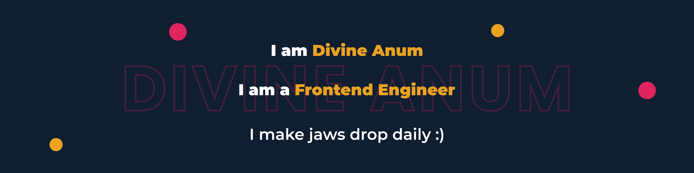

  

<!--  -->

<h3 align="left">I'm a learning machine, gamer, developer and a classical music enthusiast🎼.</h3>

<!-- - 🏁 I'm looking forward to learning: `ElectronJS`. -->
- 🔭 I'm currently: open to full-time opportunities 😋
- 🌱 I’m learning: how to make cool animations with `GSAP`.
- ⚡ Fun fact: I love Jesus! 💖
- 🎧 Some of my favs: [Debussy 🎵](https://youtu.be/WNcsUNKlAKw),
  [Beethoven 🎵](https://youtu.be/sbTVZMJ9Z2I),
  [Einaudi 🎵](https://youtu.be/4VR-6AS0-l4),
  [Vivaldi 🎵](https://www.youtube.com/watch?v=H_3JiTfmuzg)

<h3 align="left">⚙ My Tech Stack:</h3>

<h3>🗨 Lets connect :</h3>

<!-- 

    
     
    
     

 -->

<!-- 

 -->
