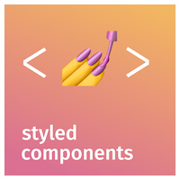

  

<h3 align="left">I'm a student, reader, gamer, developer and a huge fan of classical music 🎼.</h3>

- 🔭 I'm currently working on:  freelance and personal side projects 😋

- 🌱 I’m currently learning: how to make cool animations with `GSAP`.
- 🏁 I'm looking forward to learning: `ElectronJS`.
- 👯 I’m looking to collaborate on:  web apps and sites.
- 💬 Ask me about:  Python, frontend or classical music. 😎
- ⚡ Fun fact: I'm working on being ambidextrous! 😅
- 🎧 Bless your ears: [Beethoven 🎵](https://www.youtube.com/watch?v=BV7RkEL6oRc),
  [Liszt 🎵](https://www.youtube.com/watch?v=H1Dvg2MxQn8),
  [Tchaikovsky🎵](https://www.youtube.com/watch?v=sdduPpnqre4),
  [Vivaldi 🎵](https://www.youtube.com/watch?v=H_3JiTfmuzg)

<!-- Logos-->

<h3 align="left">⚙ My Tech Stack:</h3>

&nbsp;&nbsp;
&nbsp;&nbsp;
&nbsp;&nbsp;
  &nbsp;&nbsp;
&nbsp;&nbsp;
&nbsp;&nbsp;
&nbsp;&nbsp; 
&nbsp;&nbsp; 
&nbsp;&nbsp; 
&nbsp;&nbsp; 
 
&nbsp;&nbsp;
 
&nbsp;&nbsp;

<h3>🗨 Lets talk! :</h3>

&nbsp;&nbsp;
&nbsp;&nbsp;
&nbsp;&nbsp;
&nbsp;&nbsp;

    
     
    
     
    <!--  -->

<!--  -->
